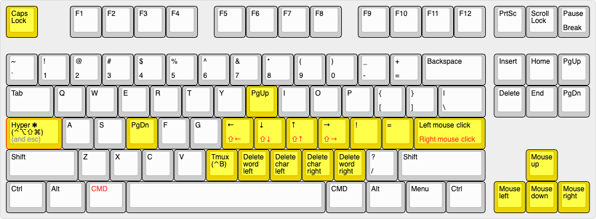

# CapsLock

* CapsLock Enhancement is based on Project [`Karabiner-Elements`](https://pqrs.org/osx/karabiner/)


## Install

1. Download [Karabiner-Elements](https://pqrs.org/osx/karabiner/) and Install
2. Open the URL below in Safari to import the configuration.
```
karabiner://karabiner/assets/complex_modifications/import?url=https://raw.githubusercontent.com/kabouzeid/Capslock/master/capslock.json
```

3. Open Karabiner, Tab "ComplexModification", Button "Add Item", and enable entries you like.
4. Default conf file path is `$HOME/.config/karabiner/assets/complex_modifications`.
5. Enable functions: `[App] karabiner-elements -> [Tab] Complex Modification -> Add Item`


#### Notice

- Asset directory: `$HOME/.config/karabiner/assets/complex_modifications`

- Main conf file path: `$HOME/.config/karabiner/karabiner.json`

## Usage



### Basic

`✱` Hyper actually maps to `⌃⌥⇧⌘` (all right modifiers) , It works well with additional left modifiers. And compatible with most application. Hold CapsLock to enable `Hyper` funcationality and press it alone to emit an `Escape`.

| Origin    | Maps to    | Comment                    |
| --------- | ---------- | -------------------------- |
| `⇪` Press | `⎋` Escape | Press alone to escape      |
| `⇪` Hold  | `✱`  Hyper | Enable Hyper Functionality |

### Navigation

- Hold  `✱` Hyper to enable navigators
- Hold additional `⌘` Command or `⇧` Shift for **selection**. (Just like holding Shift with arrow key)
- Hold additional `⌥`  with `HJKL`  for **mouse movement**.
- Hold additional `⌃`  with `HJKL`  for **desktop management**. (Just like holding Ctrl with arrow key)

| Origin | Maps to         | Comment                    |
| ------ | --------------- | -------------------------- |
| `H`    | `←` LeftArrow   | cursor left                |
| `J`    | `↓` DownArrow   | cursor down                |
| `K`    | `↑` UpArrow     | cursor up                  |
| `L`    | `→` RightArrow  | cursor right               |
| `U`    | `⇞` PageUp      | cursor page up             |
| `D`    | `⇟` PageDn      | cursor page down           |
| `⌘H`   | `⇧←` LeftArrow  | cursor left and selection  |
| `⌘J`   | `⇧↓` DownArrow  | cursor down and selection  |
| `⌘K`   | `⇧↑` UpArrow    | cursor up and selection    |
| `⌘L`   | `⇧→` RightArrow | cursor right and selection |
| `⇧H`   | `⇧←` LeftArrow  | cursor left and selection  |
| `⇧J`   | `⇧↓` DownArrow  | cursor down and selection  |
| `⇧K`   | `⇧↑` UpArrow    | cursor up and selection    |
| `⇧L`   | `⇧→` RightArrow | cursor right and selection |
| `⌥H`   | `←` LeftArrow   | mouse left                 |
| `⌥J`   | `↓` DownArrow   | mouse down                 |
| `⌥K`   | `↑` UpArrow     | mouse up                   |
| `⌥L`   | `→` RightArrow  | mouse right                |
| `⌃H`   | `←` LeftArrow   | expose all                 |
| `⌃J`   | `↓` DownArrow   | show desktops              |
| `⌃K`   | `↑` UpArrow     | switch prev desktop        |
| `⌃L`   | `→` RightArrow  | switch next desktop        |


### Mousekey

- Emulate mouse with keyboard
- Also can be archived with `⌥`  and `HJKL`

| Origin | Maps to    | Comment                  |
| ------ | ---------- | ------------------------ |
| `←`    | MouseLeft  | mouse cursor left        |
| `↓`    | MouseDown  | mouse cursor down        |
| `↑`    | MouseUp    | mouse cursor up          |
| `→`    | MouseRight | mouse cursor right       |
| `↩`    | MouseLeft  | mouse left button click  |
| `⌘↩`   | MouseRight | mouse right button click |

### Deletion

| Origin    | Maps to                            | Comment                 |
| --------- | ---------------------------------- | ----------------------- |
| `N`       | `⌥⌫`  Option + ForwardDelete       | Delete a word ahead     |
| `M`       | `⌫` ForwardDelete                  | Delete a char ahead     |
| `,`       | `⌦` Delete                         | Delete a char after     |
| `.`       | `⌥⌦` Option + Delete               | Delete a word after     |
| `⌘N`,`⌘M` | `⌘⌥⌫` Command+Option+ForwardDelete | Delete to start of line |

### Tmux

| Origin | Maps to     | Comment                                      |
| ------ | ----------- | -------------------------------------------- |
| `B`    | `⌃B`Ctrl+B  | Default [Tmux](http://tmux.github.io) prefix |

### Easy != and ==

| Origin             | Maps to | Comment                  |
| ------------------ | ------- | ------------------------ |
| `;` Semicolon      | `!`     | Exclamation              |
| `'` Single Quote   | `=`     | EqualSign                |

### Escape CapsLock

| Origin                 | Maps to             | Comment                                        |
| ---------------------- | ------------------- | ---------------------------------------------- |
| `⎋` Escape             | `⇪`  CapsLock       | Bug: Difficult to turn capslock off after emit |
